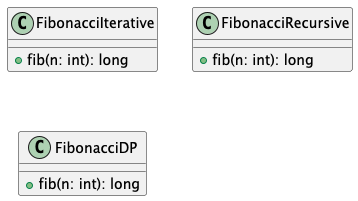
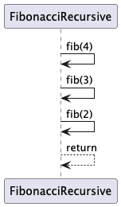
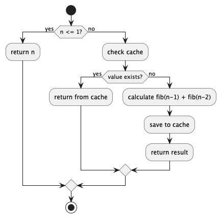

# Fibonacci Algorithms

## Реалізації
У проєкті реалізовано три підходи до обчислення чисел Фібоначчі:

- Iterative (ітераційний)
- Recursive (рекурсивний)
- Dynamic Programming (з кешуванням)

---

## Complexity Analysis

### Iterative
- Time Complexity: O(n) — один цикл до n
- Space Complexity: O(1) — використовується лише кілька змінних

### Recursive
- Time Complexity: O(2^n) — кожен виклик породжує два нових
- Space Complexity: O(n) — через глибину стеку викликів

### Dynamic Programming
- Time Complexity: O(n) — кожне значення обчислюється один раз
- Space Complexity: O(n) — використовується кеш для збереження результатів

---

## UML Diagrams

### Class Diagram (загальна структура)

### Sequence Diagram (рекурсивний підхід)

### Activity Diagram (ітераційний підхід)
